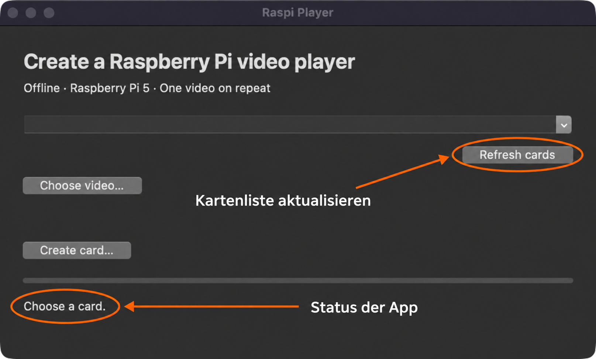
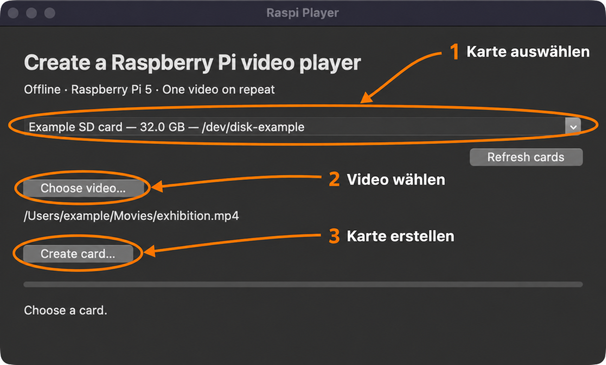

# Raspi Player

**Ein Video auswählen, eine SD-Karte erstellen, am Raspberry Pi abspielen.**
Raspi Player ist eine Mac-App für einen Raspberry Pi 5. Der Pi spielt dein Video
automatisch im Vollbild und in einer Endlosschleife ab – ohne Internet, Tastatur
oder Anmeldung. Python und Terminal brauchst du für die fertige App nicht.

## Das brauchst du

- Einen Mac mit **Apple-Chip (M1 oder neuer)** und **macOS 13 oder neuer** für die
  aktuelle `arm64`-Ausgabe. Intel-Macs benötigen eine eigene `x86_64`-Ausgabe.
- Einen Raspberry Pi 5 mit passendem Netzteil, Bildschirm und Micro-HDMI-Kabel.
- Einen SD-Kartenleser und eine beschreibbare microSD-Karte. Die Karte braucht
  ungefähr **6,5 GB plus die Größe deines Videos**; etwas Platz zusätzlich einplanen.
- Entsprechend viel freien Speicher auf dem Mac für die vorübergehende Vorbereitung,
  zusätzlich zum Platz für App und Download.
- Eine lokal gespeicherte Videodatei, zum Beispiel MP4. Speichere sie auf dem Mac,
  **nicht auf der SD-Karte**, die du erstellen möchtest.

## 1. App bekommen und öffnen

Die fertige Datei **`Raspi-Player-0.1.0-macos-arm64.dmg`** erhältst du vom
Projektbetreuer. Das Repository ist privat; derzeit gibt es keinen öffentlichen
Download. Wer Zugriff auf das Repository hat, kann nach einer Veröffentlichung
auch unter [Releases](https://github.com/dweigend/raspi-player/releases) nachsehen.

1. Öffne die erhaltene **DMG-Datei** mit einem Doppelklick.
2. Ziehe **Raspi Player.app** auf **Applications** (Programme).
3. Öffne im Finder **Programme → Raspi Player**. Danach kannst du das
   Installationslaufwerk im Finder auswerfen.

Auf dem Installationslaufwerk liegt auch **README.html**: Per Doppelklick öffnest
du diese Anleitung mit allen Bildern im Browser, auch ohne Internet.

Alles für die Kartenerstellung steckt in der App. Du musst keinen zusätzlichen
Ordner mitkopieren und kein Raspberry Pi Imager installieren.

**Beim ersten Öffnen:** Diese Ausgabe ist nicht von Apple notarisiert und besitzt
keine bestätigte Entwickler-ID. Falls macOS deshalb das Öffnen blockiert, schließe
die Meldung und gehe zu **Systemeinstellungen → Datenschutz & Sicherheit →
Dennoch öffnen**. Bestätige anschließend **Öffnen**, wenn du die App vom
Projektbetreuer erhalten hast und ihr vertraust. Die Ausnahme gilt nur für diese
App. [Apples Anleitung zum Öffnen solcher Apps](https://support.apple.com/de-de/102445)
beschreibt die einzelnen Schritte.

So sieht die App nach dem Öffnen aus. **Refresh cards** sucht nach SD-Karten;
mit **Choose video…** wählst du anschließend deine Videodatei.



## 2. SD-Karte und Video auswählen

**Achtung: Alle vorhandenen Dateien auf der ausgewählten SD-Karte werden gelöscht.**
Sichere wichtige Dateien vorher und kontrolliere die Karte anhand ihres Namens
und ihrer Größe.

1. Stecke die SD-Karte in den Kartenleser und verbinde ihn mit dem Mac.
2. Klicke auf **Refresh cards**, um die Kartenliste zu aktualisieren.
3. Wähle im oberen Auswahlfeld die richtige SD-Karte aus.
4. Klicke auf **Choose video…** und öffne deine Videodatei.
5. Klicke auf **Create card…**.



Das erste Bild zeigt die fertig gebaute Mac-App direkt nach dem Öffnen. Das zweite
zeigt die Auswahl mit Beispieldaten: **Example SD card**, `/dev/disk-example`
und `/Users/example/Movies/exhibition.mp4`. Pfeile und Einkreisungen wurden mit
Image Gen ergänzt. Die Bilder zeigen keinen Schreibvorgang auf einer echten Karte.

## 3. Löschen bestätigen und warten

Im Fenster **Erase selected SD card?** stehen noch einmal die Karte und dein Video.
Prüfe beides. Klicke nur bei der richtigen Karte auf **Yes**; mit **No** brichst du ab.

Die App bereitet das System vor, schreibt die Karte, prüft das Ergebnis und wirft
sie aus. Erlaube gegebenenfalls den macOS-Zugriff auf Wechselmedien und bestätige
die Administratorabfrage für das Schreiben.

**Lass die Karte eingesteckt und die App geöffnet, bis unten „Ready. Insert the
card into your Pi 5 and power it on.“ steht.** Die Vorbereitung und Prüfung können
mehrere Minuten dauern. Erst diese Fertigmeldung bestätigt den abgeschlossenen
Vorgang. Bei einer Fehlermeldung ist die Karte noch nicht bereit.

## 4. Video am Raspberry Pi starten

1. Stecke die fertige Karte in den **ausgeschalteten Raspberry Pi 5**.
2. Verbinde den Bildschirm mit **HDMI0**, dem Micro-HDMI-Anschluss direkt neben
   dem USB-C-Stromanschluss. Schalte den Bildschirm ein und wähle den HDMI-Eingang.
3. Schließe das Netzteil des Pi an.
4. Warte die erste Einrichtung und den **automatischen Neustart** ab. Lass dabei
   den Strom angeschlossen. Danach startet das Video von selbst.

Das Video wiederholt sich automatisch; eine kurze Pause zwischen den Durchläufen
ist möglich. Für ein anderes Video erstellst du die Karte mit der App erneut.

## Wenn etwas nicht klappt

| Problem | Das kannst du tun |
| --- | --- |
| Keine Karte sichtbar | macOS-Abfrage für Wechselmedien bestätigen, Kartenleser neu verbinden und **Refresh cards** klicken. Schreibschutz am SD-Adapter prüfen. |
| Zu wenig Speicher | Größere SD-Karte verwenden oder Speicher auf dem Mac freimachen. Benötigt werden jeweils etwa 6,5 GB plus Video und etwas Reserve. |
| Schreiben oder Prüfen fehlgeschlagen | Karte neu verbinden, mit **Refresh cards** aktualisieren und erneut erstellen. Die Fehlerdetails an den Projektbetreuer weitergeben. |
| Offline-Dateien oder Imager fehlen | Die vollständige App erneut aus der DMG nach Programme kopieren. Für die fertige App ist keine Terminal-Einrichtung vorgesehen. |
| Schwarzer Bildschirm | HDMI0 und den richtigen Bildschirmeingang prüfen. Erste Einrichtung samt Neustart abwarten. Bei anhaltendem Fehler die [Diagnoseanleitung](docs/validation.md) verwenden. |
| Kein Ton | Bildschirm vor dem Pi einschalten, Monitorlautstärke prüfen und den Pi neu starten. Der Bildschirm muss HDMI-Ton unterstützen. |
| Video ruckelt oder startet nicht | Die tatsächliche Videodatei am Pi testen. Eine unterstützte Dateiendung garantiert keinen passenden Codec; die App konvertiert Videos nicht. |

Die Ausgabe verwendet **1920 × 1080 bei 60 Hz über HDMI0**. Bild und HDMI-Ton wurden
auf einem Pi 5 mit einem LG-4K-Monitor vom Betreiber bestätigt; andere Kombinationen
und Videodateien brauchen einen eigenen Test. Die neue Mac-Verpackung und die
Beispiel-Screenshots ersetzen diesen [Hardwaretest](docs/validation.md) nicht.
Details zur bisherigen Prüfung stehen im [Diagnosebericht](docs/diagnosis-2026-09-09.md).

<details>
<summary>Für Entwicklung und eigene Builds</summary>

Benötigt werden [uv](https://docs.astral.sh/uv/) und Python 3.13 mit Tk.
Die Online-Vorbereitung lädt einmalig das festgelegte Raspberry-Pi-System und den
nativen Imager. Anschließend läuft die Kartenerstellung offline.

```sh
uv sync --locked
uv run raspi-player prepare-offline
uv run raspi-player
```

Vor dem Build die Projektprüfungen ausführen:

```sh
uv run ruff check .
uv run ruff format --check .
uv run ty check --exclude src/raspi_player/payload
uv run ty check --python-platform linux src/raspi_player/payload
uv run pytest
uv build
uv run python scripts/build_app.py
```

Auf einem Apple-Silicon-Mac entstehen `dist/Raspi Player.app`,
`dist/Raspi-Player-0.1.0-macos-arm64.dmg` und die zugehörige `.dmg.sha256`-Datei.
Der Build muss auf der jeweiligen Zielplattform erfolgen. Unter Windows entsteht
ein portabler Ordner; dort müssen Anwendung und `offline`-Ordner zusammenbleiben.

Weitere Entwicklerbefehle:

```sh
uv run raspi-player disks
uv run raspi-player image /path/to/video.mp4 /path/to/card.img
uv run raspi-player --assets /path/to/offline
```

`disks` liest die Kartenliste; `image` erzeugt nur eine normale Image-Datei.
`--assets` startet die App mit einem anderen Offline-Ordner. Tatsächliches Schreiben
erfolgt ausschließlich über die Bestätigung in der App. Große Videos werden auf
exFAT abgelegt. Es gibt keine Playlists, Netzwerksteuerung oder automatische
Videokonvertierung; beliebiges Abschalten des Stroms ist nicht verlustfrei garantiert.

[Build und Verteilung](docs/offline-bundles.md) ·
[Architektur](docs/architecture.md) ·
[Tests und Diagnose](docs/validation.md) ·
[Drittanbieter und Lizenzen](THIRD_PARTY.md)

</details>
